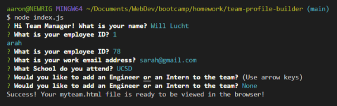
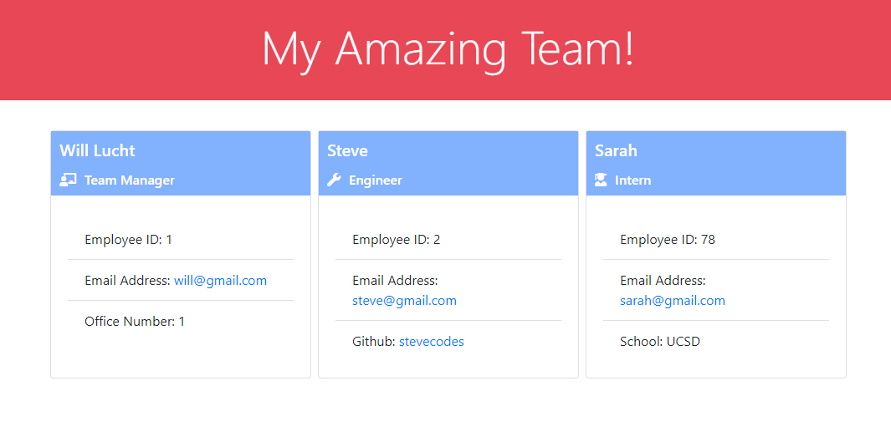

# team-profile-builder

## Description
This simple command line application will prompt the user to build out their team! The user will be prompted to select a name, an employee ID, an email address for ALL employees. In addition to name, email, and ID all Engineers will be prompted to enter their Github usernames. In addition to name, email, and ID all Interns will be prompted to enter in the school that they attend.
## Table of Contents
- [Installation](#installation)
- [Usage](#usage)
- [Credits](#credits)
- [License](#license)

## Badges

## Installation
   
Run `npm i` in the command line terminal.
    
## Usage
    
Run `node index.js` in the terminal to be prompted with questions for your team builder!
    
Here is a quick video guide: https://youtu.be/csNWKQkRNaU
    
## Credits
    
Created by [d606n6k](https://github.com/d606n6k)
    
## License
License: MIT

## Features
- Quickly create a webpage with basic information about your team!

## How to Contribute
If you would like to contribute to this project, please fork the project as needed.

## Questions
Have any questions for the author? Contact this author via [Email](mailto:aaronlucht@gmail.com)

Check out the author's [Github](https://github.com/d606n6k)

## Tests
To run tests, run the following command:
`npm test` in the terminal